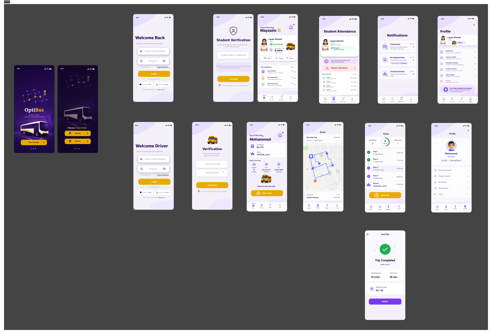

# 📱 System Interface

This folder contains the user interface (UI) design of the OptiBus mobile application.

The interface includes dedicated screens for both parents and drivers, providing each user with the features required to support the daily school transportation process.

---

## Parent Interfaces

The parent interfaces include:

- Welcome and role selection
- Parent login
- Student verification
- Home dashboard
- Student attendance management
- Absence reporting
- Notifications
- Parent profile

These interfaces allow parents to access transportation information, report a student's absence before the daily trip, and receive transportation-related notifications.

---

## Driver Interfaces

The driver interfaces include:

- Driver login
- Driver verification
- Home dashboard
- Route visualization
- Stops management
- Driver profile
- Trip completion

These interfaces enable drivers to access their assigned routes, monitor trip progress, and complete daily transportation operations.

---

## Interface Preview

---

## Note

The interfaces presented in this folder were created as part of the OptiBus system design to represent the expected user experience and interaction flow for different user roles within the application.
